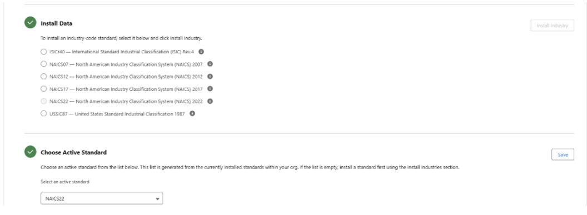
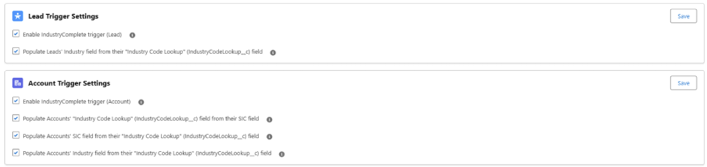
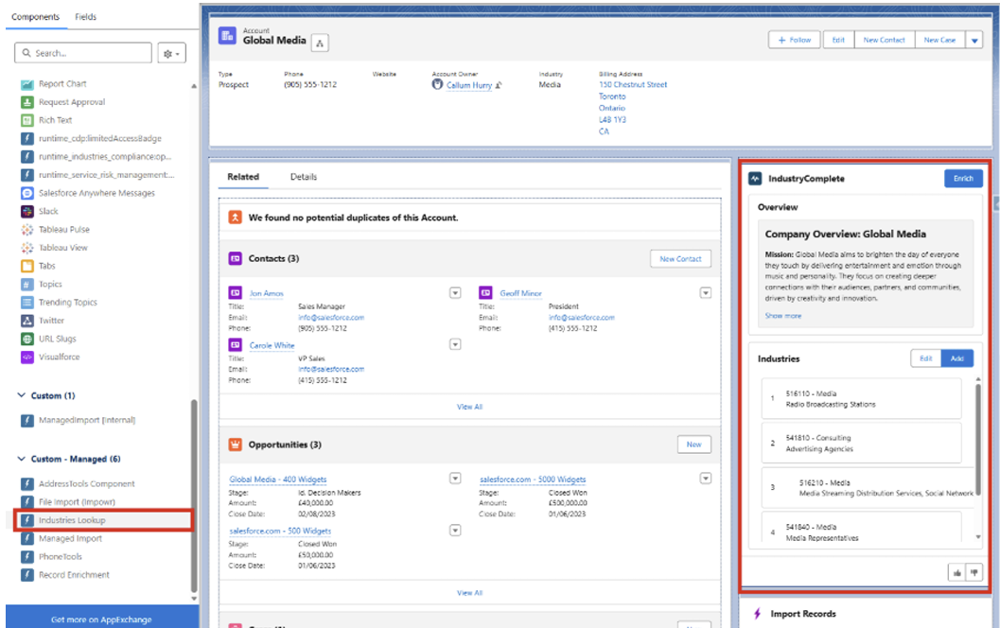

# IndustryComplete Enrichment Installation

## Overview

This guide walks through the initial setup and configuration of IndustryComplete. It covers Permission Set assignment, External Client App authorisation, Remote Site registration, Industry Code installation, and adding the Enrichment Component to a Lightning Record Page.

---

## Prerequisites

- IndustryComplete installed in the target org
- System Administrator profile
- Access to Setup in the target org

---

## Step 1: Permission Set Assignment

Permission Sets control access to IndustryComplete features. Three Permission Sets need to be configured: two packaged ones for standard and admin users, and a custom one for External Client App access.

To streamline the setup, we'll start by creating the custom Permission Set for the External Client App access.

### 1a. Create a Custom Permission Set

1. Navigate to **Setup > Permission Sets**.
2. Click **New**.
3. Enter the following details:

| Field | Value |
|-------|-------|
| **Label** | `IndustryComplete External Client App Access` |
| **API Name** | `IndustryCompleteExternalClientAppAccess` |
| **Description** | Grants access to the IndustryComplete External Client App |

4. Click **Save**.

### 1b. Assign Permission Sets to Users

Assign the following Permission Sets to the appropriate users:

| Permission Set | Assign To | Purpose |
|----------------|-----------|---------|
| `IndustryComplete External Client App Access` | All users | External Client App access |
| `IndustryComplete Standard User` | All users | Standard feature access |
| `IndustryComplete Admin User` | Admin user (you) | Administration and configuration |

> **Note:** The admin Permission Set should only be assigned to users who need to manage IndustryComplete configuration, such as installing industry codes.

---

## Step 2: Configure the External Client App

The External Client App must be configured to restrict access to pre-authorised users via the Permission Set created in Step 1a.

### 2a. Update OAuth Policies

1. Navigate to **Setup > External Client Apps**.
2. Locate and select **IndustryComplete**.
3. In the **OAuth Policies** section, change **Permitted Users** to:

   `Admin-approved users are pre-authorized`

### 2b. Assign the Permission Set to App Policies

1. Still on the IndustryComplete External Client App page, navigate to the **App Policies** section.
2. Under **Select Permission Sets**, add the `IndustryComplete External Client App Access` Permission Set.
3. Save changes.

> **Note:** This ensures only users with the `IndustryComplete External Client App Access` Permission Set can interact with the IndustryComplete External Client App.

---

## Step 3: Install Industry Classification Codes

IndustryComplete requires an industry classification dataset to function.

1. Open the **App Launcher**.
2. Search for and select **IndustryComplete Administration**.
3. Install the appropriate industry code set (e.g. **NAICS22** or **ISICr40**).
4. Select your active standard in the **Choose Active Standard** section.
5. Click **Save**.

> **Note:** This step requires the `IndustryComplete Admin User` Permission Set. Installation may take a moment to complete depending on the dataset size.

---

## Step 4: Activate the IndustryComplete Triggers

IndustryComplete benefits from using optional triggers to improve behaviour on your Account/Lead records. These triggers are provided with the package and can be activated by:

1. Navigate to **IndustryComplete Administration > Settings** tab.
2. Activate the relevant triggers for your Account and Lead records.
3. Click **Save**.

---

## Step 5: Add Record Enrichment to Page Layouts

The final step is to add the Record Enrichment Lightning component to your Lead and Account record pages, enabling users to enrich records directly from the record detail view.

1. Navigate to a Lead or Account record.
2. Click the **gear icon** and select **Edit Page** to open the Lightning App Builder.
3. In the component panel on the left, search for `Record Enrichment`.
4. Drag the **Record Enrichment** component onto the desired position on the page layout.
5. Click **Save** and **Activate** the page (assign as org default, app default, or record type default as appropriate).
6. Repeat for both the Lead and Account record pages.

---

## Verification

After completing all steps, verify the setup:

- [ ] Confirm Permission Sets are assigned correctly by checking a user's assigned Permission Sets in Setup.
- [ ] Open IndustryComplete Administration to verify the industry codes installed successfully.
- [ ] Open a Lead or Account record and confirm the Record Enrichment component is visible.
- [ ] Test the enrichment functionality to ensure the tool is working.
- [ ] Note: for record enrichment, an Account/Lead will need the correct company name, website, and country.
