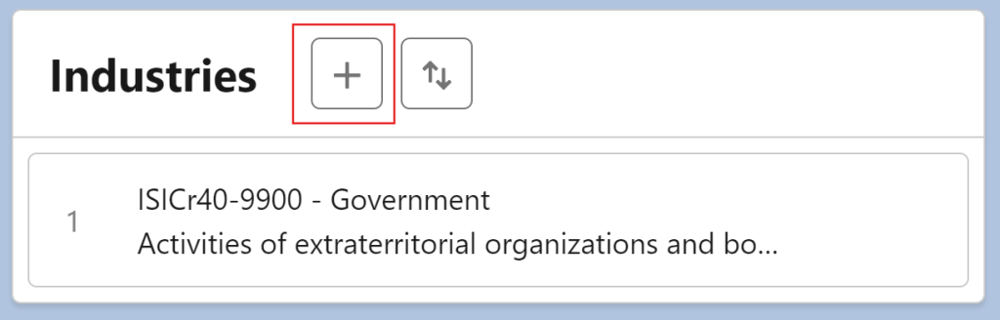
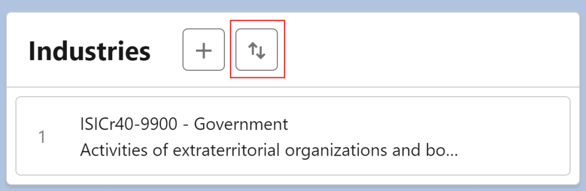
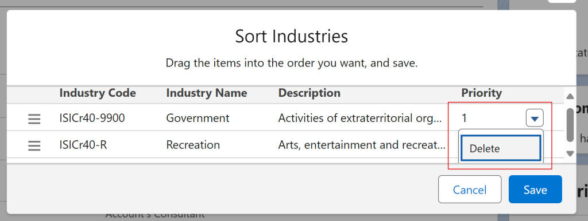

# Using IndustryComplete

## Overview

The IndustryComplete component allows users to:

- Add industry codes to records.
- Sort and delete existing industry codes to keep your records organized and relevant.

The component includes two main buttons as shown in the interface:

**Add Industry Code Button** – Allows you to search for, and add, a new industry code to the record.

**Sort/Delete Industry Button** – Enables you to alter the displayed order of existing industry codes or delete selected codes.

---

## Step-by-Step Guide

### 1. Adding an Industry Code

1. Navigate to the record page where the IndustryComplete component is installed.
2. Click the **`+`** button to open the industry code selection window.
3. Search for and select the desired industry code from the list.
4. Confirm your selection by clicking **Add** to add the code to the record.

### 2. Sorting Industry Codes

1. Click the **`⇅`** button to enable sorting.
2. Rearrange the industry codes in the desired order by dragging and dropping them.
3. Once satisfied, save the new order to reflect the updated sequence.

### 3. Deleting an Industry Code

1. To delete an industry code, first click the **`⇅`** button.
2. Select the dropdown button next to the code you want to remove.
3. Confirm the deletion to remove it from the list.

